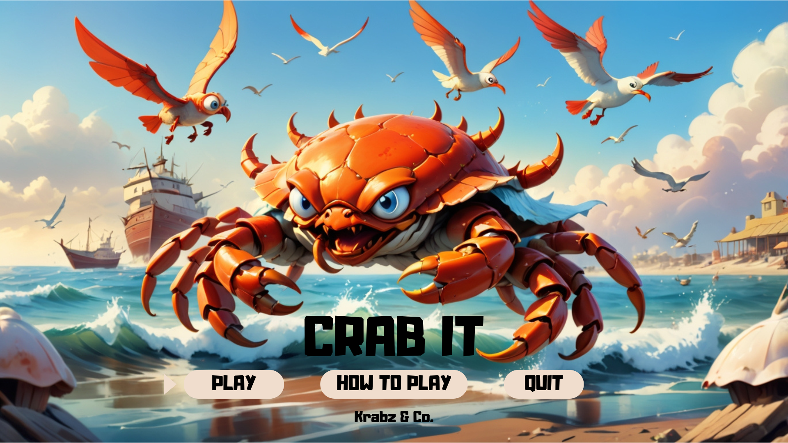
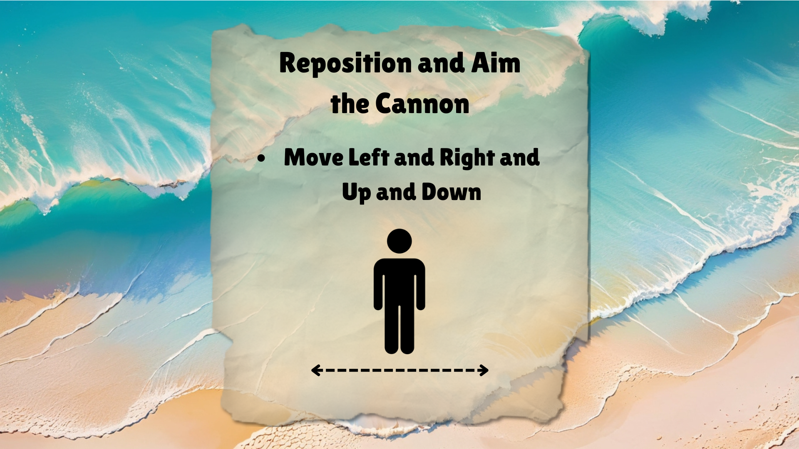
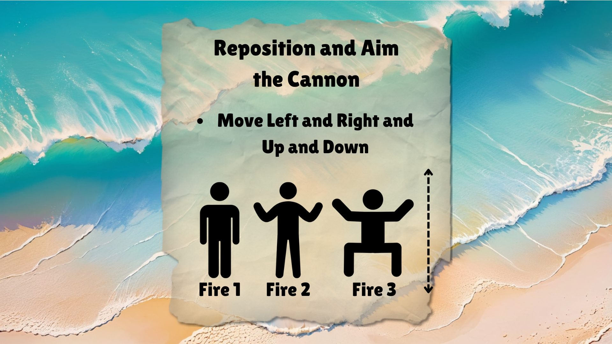
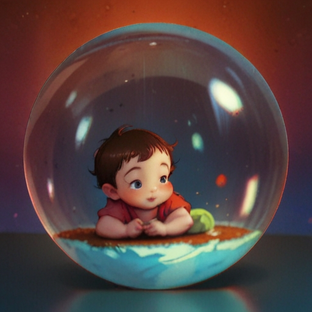

# Crab it
A game about shooting crabs, using your body to track movement.

You move the cannon and aim through various body movements, and use your voice to command the crab to fire. You also can generate a custom cannonball, which will look and act different. Your custom cannonball will then be graded on various properties.

The game uses various AI technologies to support all of this functionality. 

# Technology and tools used
- Unity: game engine
- Mediapipe: translating body movements to machine-readable data
- LLMUnity: Unity package to integrate language models
- Mistral: Open source language model used to rate cannonballs
- Leonardo: Webapp to generating cannonball graphics 
- Python speech recognition library: Recognizing and transcribing voice files

# How to play

# Example custom generated cannonball

